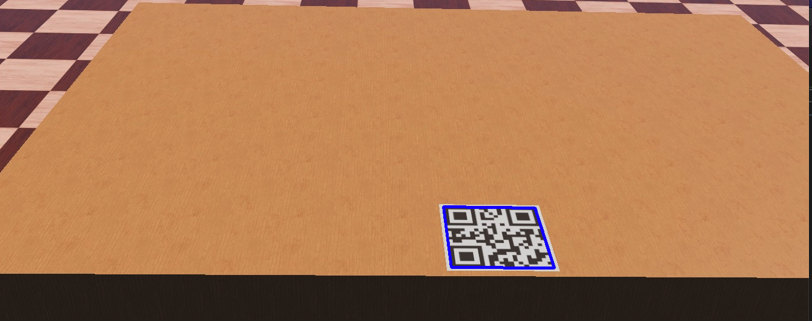
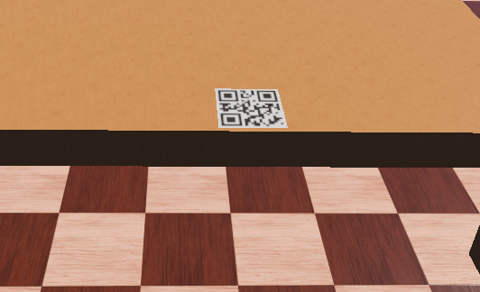
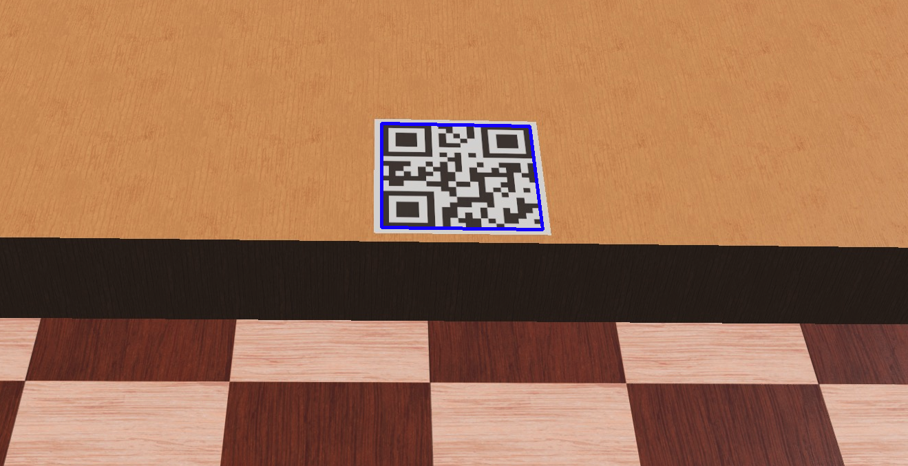
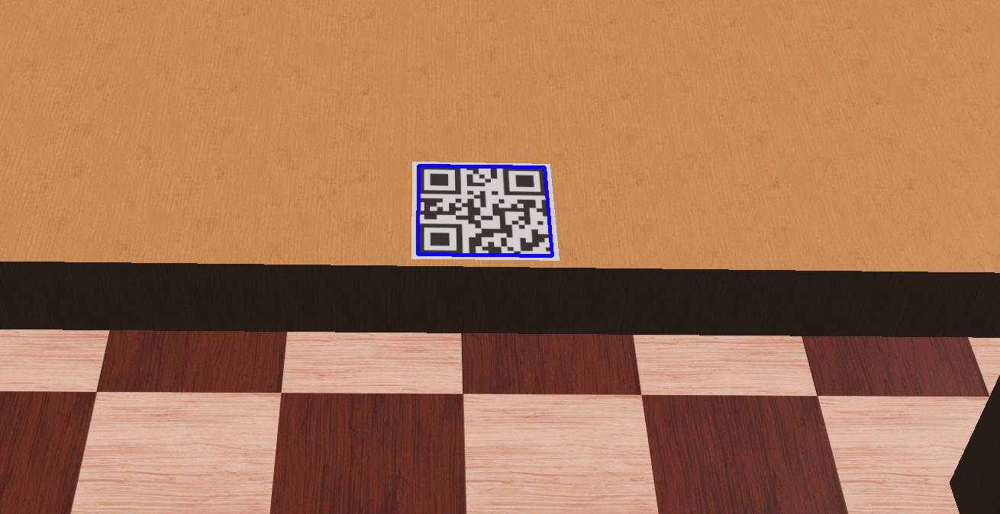
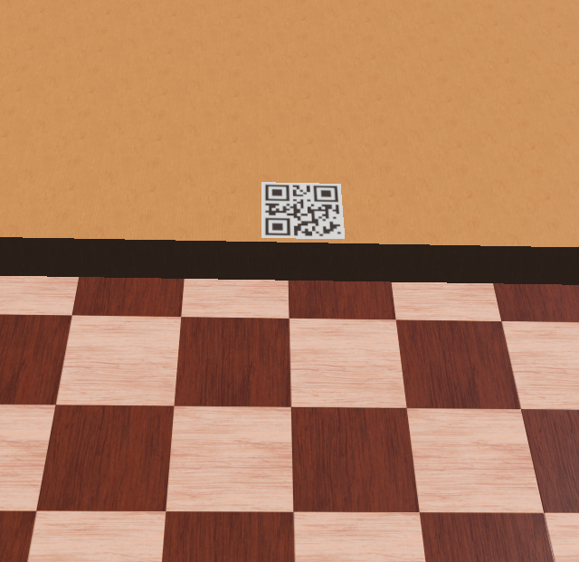
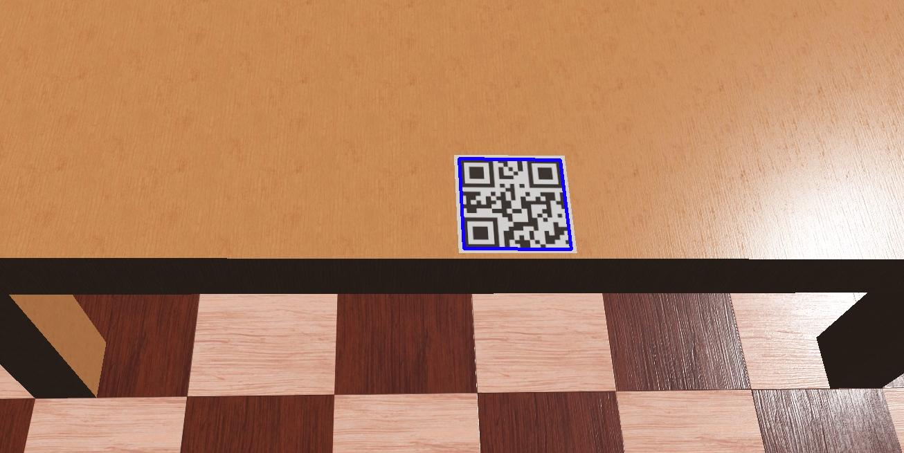
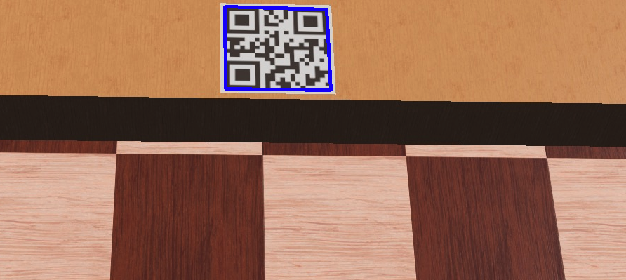

ClyDe contains several subsystems(Described in "System" and "How it works" sections). Each of these have been thourogly tested, as we had to ensure they were functioning correctly before trying to inegrate them together. Havign confirmed the reliability and functionality of each subsystem, we could more easily put them together and resolve errors quickly.The three subsystems we have focused the most on are navigation, obstruction detection and QR code detection. 

## Navigation
A key feature of ClyDe is being able to navigate from one place to another in a quick, safe and reliable way. Of thesem safety and reliability are most important. Therefore we ran several tests to invesigate this, in one of our Webots test worlds. Below is a table with the results of a test investigating how often the navigation reaches its goal pose. The measurements are using the navigator's internal coordinate representation.

| Table | Goal Pose            | Mean Achieved Pose    | Success |
| ----- | -------------------- | --------------------- | ------- |
| 1     | 0.35 0.90 0.70 0.70  | 0.46 0.99 0.80 0.61   | 5/5     |
| 2     | -1.20 0.50 0.70 0.70 | -1.33 0.53 0.50 0.87  | 4/5     |
| 3     | 0.3 -4.7 0.0 1.0     | 0.24 -4.5 5 0.10 0.96 | 4/5     |
| 4     | 0.3 -3.7 0.0 1.0     | 0.23 -3.62 0.21 0.95  | 5/5     |
| 5     | 0.3 -2.7 0.0 1.0     | 0.18 -2.81 0.09 0.99  | 5/5     |
| 6     | 1.8 -4.7 0.0 1.0     | 1.77 -4.88 -0.09 1.11 | 3/5     |
| 7     | 1.8 -3.7 0.0 1.0     | 1.64 -3.58 -0.03 1.06 | 4/5     |
| 8     | 1.8 -2.7 0.0 1.0     | 1.73 -2.64 0.05 0.91  | 3/5     |

As can be seen from the table, the navigator is quite reliable. However, sometimes the robots gets stuck on an obstacle, and does not manage to reach its goal.

## Obstruction Detection

| **Attr. to change ↓** | **Brightness/cd** | **Obs. pos** | **Obs. size** | **Obs. color** | **Table color** | **Reflect light** | **Shadow (Gradient)** | **Outcome** |
| --------------------- | ----------------- | ------------ | ------------- | -------------- | --------------- | ----------------- | --------------------- | ----------- |
| **Illumination**      |                   |              |               |                |                 |                   |                       |
|                       | 0-20              | middle       | middle        | light          | brown           | None              | None                  | Success     |
|                       | 20-40             | middle       | middle        | green          | brown           | None              | None                  | Success     |
|                       | 40-60             | middle       | middle        | green          | brown           | None              | None                  | Success     |
|                       | 60-80             | middle       | middle        | green          | brown           | None              | None                  | Success     |
| **Position**          |                   |              |               |                |                 |                   |                       |
|                       | 40-60             | left         | middle        | green          | brown           | None              | None                  | Success     |
|                       | 40-60             | right        | middle        | green          | brown           | None              | None                  | Success     |
|                       | 40-60             | top          | middle        | green          | brown           | None              | None                  | Success     |
|                       | 40-60             | bottom       | middle        | green          | brown           | None              | None                  | Success     |
| **Size**              |                   |              |               |                |                 |                   |                       |
|                       | 40-60             | middle       | small         | green          | brown           | None              | None                  | Success     |
|                       | 40-60             | middle       | large         | green          | brown           | None              | None                  | Success     |
| **Obs. Colour**       |                   |              |               |                |                 |                   |                       |
|                       | 40-60             | middle       | middle        | brown          | brown           | None              | None                  | Success     |
|                       | 40-60             | middle       | middle        | black          | black           | None              | None                  | Fail        |
| **Table color**       |                   |              |               |                |                 |                   |                       |
|                       | 40-60             | middle       | middle        | brown          | dark            | None              | None                  | Success     |
| **Reflected light**   |                   |              |               |                |                 |                   |                       |
|                       | 40-60             | middle       | middle        | green          | brown           | Yes               | None                  | Success     |
| **Shadow**            |                   |              |               |                |                 |                   |                       |
|                       | 40-60             | middle       | middle        | green          | brown           | None              | low                   | Success     |
|                       | 40-60             | middle       | middle        | green          | brown           | None              | high                  | Fail        |

## QR Code detection

| Angle/degree | Distance/meter | Detected | Graph                                  |
| ------------ | -------------- | -------- | -------------------------------------- |
| 10           | 5              | no       |   |
| 10           | 10             | no       |   |
| 10           | 15             | no       |   |
| 30           | 5              | yes      |   |
| 30           | 10             | no       |   |
| 30           | 15             | no       |   |
| 45           | 5              | yes      |   |
| 45           | 10             | yes      |  |
| 45           | 15             | no       |  |
| 60           | 5              | yes      |   |
| 60           | 10             | yes      |  |

# Shortcomings and Attempted Solutions

### Problem: Instability and documentation issues.
Getting ROS2 to work on everyone’s systems proved to bea setback. Identical installations on new Virtual Machinesproduced different errors.  Even at the end of the projectthis is causing errors for some team members. Parts of ourissues stem from there being little documentation on ROS2as a whole, but also on Webots and how the two interact.We believe this issue will have to be rectified before ROS2and its Webots integration can be considered accessible tobeginners. 

Unfortunately, this was inevitable due to the necessity ofsimulating the robot and so there were no direct solutions tothis. We did however have an error channel on our Siscordserver to efficiently help anyone who was having compati-bility issues, and this helped us solve many. 

In hindsight, we believe we would have preferred to gowith Gazebo over Webots as it provides a better platform toimplement in-depth features at higher efficiency. Gazeboalso has far more examples and documentation.  Had webeen able to work directly with the robot we predict thatintegration would have been more seamless
### Problem: Navigator being unreliable.
A large blocker for the navigation team was the fact that thenavigator packages seem to be inherently unreliable. Muchlike ROS2 as a whole, it seemed to be more stable on somesystems than others.  This contributed to the issues withintegrating the robot arm, as investigating them were madedifficult. 
Attempted Solution: The team investigated intothe source code of the navigator and tried to reinstall to noavail.
### Problem: Inability to perform some important qualita-tive analysis.
There are aspects of the robot that we were not able to testsince we were not working with a physical product. An ex-ample of this is the cleaning motion of the robot. While weknow it is feasible for a robot arm to carry out the motionsto properly disinfect a surface according to UK Govern-ment guidelines, we were not able to test if the way weprogrammed the arm nor the cleaning utensil we used isadequate. There is nothing we can do about this, howeverit is true that the arm and cleaning motion is somethingthat can easily be modified for future versions of ClyDeand would not require a complete overhaul as to render theproject unusable.

# Future Direction of ClyDe

### Scaled up version.
Currently, we are using the Robotis Waffle Pi as the basefor ClyDe. In reality, another base would have to be usedsince the Waffle Pi is too short to house an arm that couldreach on top of a table. This base could be custom built (i.e3D Printed) since it would not have to carry particularlyheavy loads.
### More user friendly App.
Our app works, however it is not as feature complete as wewould have liked it to be for the full product. Given time, itwould be simple to implement many important features thatwould improve user experience, such as:  Text-to-Speechfor the visually impaired, ensuring existing screen-readerswork, colourblind settings and ensuring font readability.While explicitly made for the Web, the Web Content Acces-sibility Guidelines(WCAG) 2.1 will be a useful referencefor achieving accessibility for a mobile app as well. (W3C,2018)
### Web-app for staffto interface with ClyDe.
As it stands, to start and stop ClyDe, the staffwould haveto use the ClyDe Controller which is the Raspberry Pi wesend out with the robot. While we might not be able to com-pletely get rid of the Pi since it runs the navigation package,we could introduce a web-app (or an addition to the currentapp) which could allow the staffto start and stop ClyDeas well as add desks individually from their computer orphone. This would eliminate the need to interact with thePi, and means it just needs to be left running to operate thenavigator.We believe this feature would be straight-forward to imple-ment since we already have the framework set up throughthe database for the booking system. Additionally ROS2has packages to interact with the Web.
### General Hardware improvements.
Since we were not able to create a physical robot, thereare naturally going to be some flaws in our design that willcome to light once it is actually built.  We estimate thatthese kind of issues will not require a complete overhaul ofthe design, and so this point should not be much of an issue,particularly considering that our design is a prototype.
