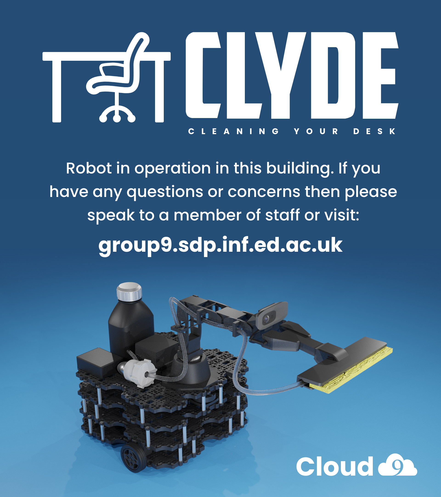

ClyDe contains several subsystems (described in the "System" and "How it works" sections). Each of these have been thoroughly tested, as we had to ensure they were functioning correctly before trying to integrate them together. Having confirmed the reliability and functionality of each subsystem, we could more easily integrate these and resolve any errors. The three subsystems we have focused the most on are navigation, obstruction detection and QR code detection. In a physical system, we would have dedicated significant time to detailed testing of exactly how well ClyDe cleans, however this was not possible in Webots. Still, after researching government guidelines and demonstrating hardware components with technicians we are confident ClyDe would do this in a safe and effective manner.
Overall, we are very satisfied with how the system functions, and would very much like to implement ClyDe physically.

## Navigation

---

A key feature of ClyDe is being able to navigate from one place to another in a quick, safe and reliable way. Of these safety and reliability are most important. Therefore we ran several tests to investigate this in one of our Webots test worlds. Below is a table with the results of a test investigating how often the navigation reaches its goal pose. The measurements are using the navigator's internal coordinate representation. The navigation was deemed to be a success if the robot is in an acceptable position to clean the table.

| Table | Goal Pose            | Average Displacement  | Success |
| ----- | -------------------- | --------------------- | ------- |
| 1     | 0.35 0.90 0.70 0.70  | 0.14 0.14             | 5/5     |
| 2     | -1.20 0.50 0.70 0.70 | 0.13  0.64            | 4/5     |
| 3     | 0.3 -4.7 0.0 1.0     | 0.21  0.11            | 4/5     |
| 4     | 0.3 -3.7 0.0 1.0     | 0.11 0.21             | 5/5     |
| 5     | 0.3 -2.7 0.0 1.0     | 0.16 0.09             | 5/5     |
| 6     | 1.8 -4.7 0.0 1.0     | 0.18 0.14             | 3/5     |
| 7     | 1.8 -3.7 0.0 1.0     | 0.13 0.06             | 4/5     |
| 8     | 1.8 -2.7 0.0 1.0     | 0.09 0.10             | 3/5     |

As can be seen from the table, the navigator is quite accurate - reaching the table successfully 87.5% of the time. However, sometimes the robots gets stuck on an obstacle, and does not manage to reach its goal. This means that the navigation parameters can be more fine-tuned and adapted to our purposes.

## Obstruction Detection
As ClyDe is currently not able to clean desks that have large obstructions on them, it is important that we have a reliable obstruction detection routine. Below is a table containing the results of tesing many possible variations that could impact the routine.

| **Attr. to change ↓** | **Brightness/cd** | **Obs. pos** | **Obs. size** | **Obs. colour** | **Table colour** | **Reflect light** | **Shadow (Gradient)** | **Outcome** |
| --------------------- | ----------------- | ------------ | ------------- | -------------- | --------------- | ----------------- | --------------------- | ----------- |
| **Illumination**      |                   |              |               |                |                 |                   |                       |
|                       | 0-20              | middle       | middle        | light          | brown           | None              | None                  | Success     |
|                       | 20-40             | middle       | middle        | green          | brown           | None              | None                  | Success     |
|                       | 40-60             | middle       | middle        | green          | brown           | None              | None                  | Success     |
|                       | 60-80             | middle       | middle        | green          | brown           | None              | None                  | Success     |
| **Position**          |                   |              |               |                |                 |                   |                       |
|                       | 40-60             | left         | middle        | green          | brown           | None              | None                  | Success     |
|                       | 40-60             | right        | middle        | green          | brown           | None              | None                  | Success     |
|                       | 40-60             | top          | middle        | green          | brown           | None              | None                  | Success     |
|                       | 40-60             | bottom       | middle        | green          | brown           | None              | None                  | Success     |
| **Size**              |                   |              |               |                |                 |                   |                       |
|                       | 40-60             | middle       | small         | green          | brown           | None              | None                  | Success     |
|                       | 40-60             | middle       | large         | green          | brown           | None              | None                  | Success     |
| **Obs. Colour**       |                   |              |               |                |                 |                   |                       |
|                       | 40-60             | middle       | middle        | brown          | brown           | None              | None                  | Success     |
|                       | 40-60             | middle       | middle        | black          | black           | None              | None                  | Fail        |
| **Table colour**      |                   |              |               |                |                 |                   |                       |
|                       | 40-60             | middle       | middle        | brown          | dark            | None              | None                  | Success     |
| **Reflected light**   |                   |              |               |                |                 |                   |                       |
|                       | 40-60             | middle       | middle        | green          | brown           | Yes               | None                  | Success     |
| **Shadow**            |                   |              |               |                |                 |                   |                       |
|                       | 40-60             | middle       | middle        | green          | brown           | None              | low                   | Success     |
|                       | 40-60             | middle       | middle        | green          | brown           | None              | high                  | Fail        |

As can be seen from the table, the obstruction detection is reliable in most circumstances. However, obstructions that are coloured black, or a large amount of shadow on the table seems to interfere with it. This is not unexpected, as lighting conditions are known to affect computer vision algorithms in various ways. Still, this means that in the future we could take more time to fine-tune the algorithm's parameters to achieve even better results. ClyDe could also be equipped with a small torch in future versions to help standardize lighting conditions.

## QR Code detection

---

ClyDe relies on QR codes attached to tables to confirm it's location and update the statuses of tables in the database. Therefore it is important that the QR code detection is reliable. Below is a table where a camera was held at several different angles and distances, to determine in what conditions QR codes could be detected.

| Angle/degree | Distance/cm | Detected |
| ------------ | ----------- | -------- |
| 10           | 5           | no       |
| 10           | 10          | no       |
| 10           | 15          | no       |
| 30           | 5           | yes      |
| 30           | 10          | no       |
| 30           | 15          | no       |
| 45           | 5           | yes      |
| 45           | 10          | yes      |
| 45           | 15          | no       |
| 60           | 5           | yes      |
| 60           | 10          | yes      |
| 60           | 15          | yes      |

As can be seen from this table, QR detection is quite reliant on angle and distance. The routine functions best when at a steep angle(looking at the code from above), and is close to the code. This data was later used to inform decisions on how to angle the arm to best detect the QR codes.

# Shortcomings and Attempted Solutions

---

### Problem: Instability and documentation issues.

Getting ROS2 to work on everyone’s systems proved to be a setback. Identical installations on new Virtual Machines even produced different errors. At the end of the project this is causing errors for some team members. Parts of our issues stem from there being little documentation on ROS2 as a whole, but also on Webots and how the two interact. We believe this issue will have to be rectified before ROS2 and its Webots integration can be considered accessible to beginners.

Unfortunately, this was inevitable due to the necessity of simulating the robot and so there were no direct solutions to this. We did however have an error channel on our Discord server to efficiently help anyone who was having compatibility issues, and this helped us solve many.

In hindsight, we believe we would have preferred to go with Gazebo over Webots as it provides a better platform to implement in-depth features at higher efficiency. Gazebo also has far more examples and documentation. Had we been able to work directly with the robot we predict that integration would have been more seamless.

### Problem: Navigator being unreliable.

A large blocker for the navigation team was the fact that the navigator packages seem to be inherently unreliable. Much like ROS2 as a whole, it seemed to be more stable on some systems than others. This contributed to the issues with integrating the robot arm, as investigating them were made difficult.
Attempted Solution: The team investigated in to the source code of the navigator and tried to reinstall to no avail.

### Problem: Inability to perform some important qualitative analysis.

There are aspects of the robot that we were not able to test since we were not working with a physical product. An example of this is the cleaning motion of the robot. While we know it is feasible for a robot arm to carry out the motions to properly disinfect a surface according to UK Government guidelines, we were not able to test if the way we programmed the arm nor the cleaning utensil we used is adequate. There is nothing we can do about this, however it is true that the arm and cleaning motion is something that can easily be modified for future versions of ClyDe and would not require a complete overhaul as to render the project unusable.

# Future Direction of ClyDe

---

### Scaled up version.

Currently, we are using the Robot is Waffle Pi as the base for ClyDe. In reality, another base would have to be used since the Waffle Pi is too short to house an arm that could reach on top of a table. This base could be custom built (i.e. 3D Printed) since it would not have to carry particularly heavy loads.

### More user friendly App.

Our app works, however it is not as feature complete as we would have liked it to be for the full product. Given time, it would be simple to implement many important features that would improve user experience, such as: Text-to-Speech for the visually impaired, ensuring existing screen-readers work, colour-blind settings and ensuring font readability. While explicitly made for the Web, the Web Content Accessibility Guidelines(WCAG) 2.1 will be a useful reference for achieving accessibility for a mobile app as well. (W3C,2018)

### Web-app for staff to interface with ClyDe.

As it stands, to start and stop ClyDe, the staff would have to use the ClyDe Controller which is the Raspberry Pi we send out with the robot. While we might not be able to completely get rid of the Pi since it runs the navigation package, we could introduce a web-app (or an addition to the current app) which could allow the staff to start and stop ClyDe as well as add desks individually from their computer or phone. This would eliminate the need to interact with the Pi, and means it just needs to be left running to operate the navigator. We believe this feature would be straight-forward to implement since we already have the framework set up through the database for the booking system. Additionally ROS2 has packages to interact with the Web.

### General Hardware improvements.

Since we were not able to create a physical robot, there are naturally going to be some flaws in our design that will come to light once it is actually built. We estimate that these kind of issues will not require a complete overhaul of the design, and so this point should not be much of an issue, particularly considering that our design is a prototype.

# Ethics

---

Our team met with an ethics expert, and we wanted to ensure that the ethics we planned for at the beginning of the project held up. There are several occasions where ethical issues could arise. However, we will prevent any personal data being abused from our system!

As our robot operates around people and has a camera on it, this obviously raises privacy concerns to them. But don't worry! We will take a series of measures to address the concerns!

- Follow all GDPR rules to maximise privacy.
- Have a clear privacy policy in the app. This includes: We will not implement any login system to store any personal information of the app users
- Add a light to the camera that lights up when the camera is active.
- Process all images locally on the robot and delete them immediately. Besides the camera will only stay open when it is trying to scan the qr code and the scope of its sight will be very limited.
- Design Clyde’s exterior to make it friendlier and be informative of its purpose.

We understand that you don't want to be distracted when you are doing your work! We will minimize the impact of the robot as much as we can!

Your library can print out the following poster to let visitors know about ClyDe:

