### The full Cloud 9 cleaning system includes several parts:

- An autonomous desk cleaning robot, named ClyDe.
- A navigation stack for moving the robot between desks and mapping an area.
- A database that holds the locations of all tables, their sizes and colours.
- An arm that is attached to ClyDe that cleans the desk.
- An accompanying app that facilitates desk booking.
- A Raspberry Pi controller computer.

These parts come together to make an autonomous sanitising system for desk tops and other flat surfaces in spaces such as libraries.

Below are more in-depth descriptions of each sub-system.

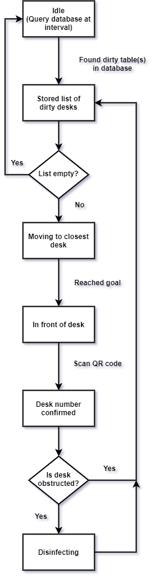

 
 
 

## Clyde Components

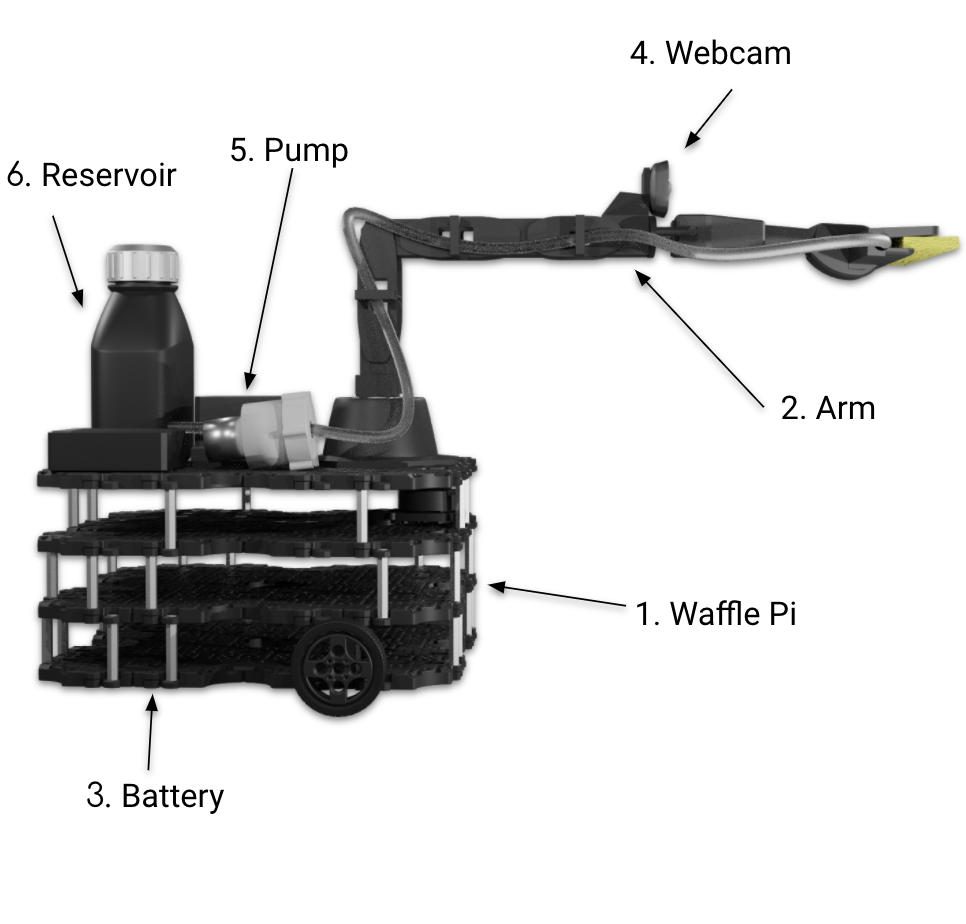

1. Waffle Pi Turtlebot:    
This is the base and core of the robot, providing essential functionality like locomotion, and sensors. It is also home to a Raspberry Pi, ClyDe’s “brain”.  
2. Pincher x100 Robot arm with cleaning tool:   
The Pincher x100 is a versatile arm. Through it the robot performs it’s essential cleaning function.  At the tip of the arm is our specially-designed cleaning tool, that takes in disinfectant that is pumped up via tubes on the arm.
3. Battery:   
The Zeee 11.1V 8000maH Lipo Battery is high-capacity, and allows the robot to operate for several hours before needing to charge. 
4. Webcam:   
The C270 Logitech USB Webcam is powerful, yet lightweight enough to be carried on the robot arm. It provides high-resolution pictures that are suitable for QR-code recognition.
5. Pump:   
The 6-12V R385 DC Diaphragm Pump is a lightweight, small, low-volume pump with a lifetime of up to 2500 hours. It is used to pump the robot’s disinfectant to the cleaning tool at the tip of the arm.
6. Reservoir:   
This contains the disinfectant liquid. Attached on the inside is a non-contact liquid sensor to monitor disinfectant levels.

## ROS2 
The core software running on the robot is the Robot Operating System 2(ROS2). ROS2 is a collection of software libraries for developing robot systems, organised as packages. It is the successor to ROS, and aims to provide several updates to its predecessor to reflect the changes in robotics since it was made in 2007. 
ROS2 works by creating nodes that are responsible for certain functions in the system, like navigation and vision. It then provides several ways for the nodes to communicate and run in paralell, which is important when trying to integrate several subsystems of a robot. Especially vital are topics, which are communication channels that nodes can publish and subscribe to, that carry data of a specified type, like a number. In ClyDe we make use of many of these features. Below is a subset of all the nodes that are running when ClyDe is active.

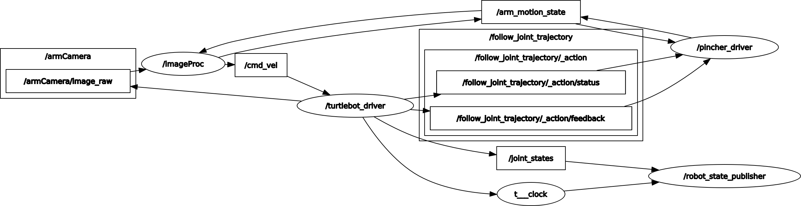

## Webots Simulator
Since we were unable to create a physical system, a simulator was needed to test our robot. Webots was used for this, as it is easy to use and integrates with ROS2 well. Webots makes changing the robot or its enviroment quick and simple. This is especially useful if you want to test new features, or repeat a test many times. In these ways the simulator is superior to a physical system for development. 
ROS2 integration happens through the webots-ros2 package, that provides an interface between the two. Tha package discovers important components like motors and sensors in Webots, and makes sure they subscribe or publish to the appropriate topics in ROS2. For example, webots_ros2 discovers ClyDe's camera, and makes sure it publishes to the 'camera/image_raw' topic. 
Especially useful is the webots_ros2_turtlebot package which provides an interface especially made for the Turtlebot 3, as well as several examples on how to use the Turtlebot 3 for map-building and navigation. Integrating ROS2 and Webots this way is preferrable to writing controller software directly in webots. This is beacuse a physical system could inherit a large part of the software written using ROS2 because it is used by most robots, including the Turtlebot 3. Webots controllers cannot do this, and would need to be rewritten using ROS2.

### The Mobile App:

When a user scans the QR code through our app, the app will connect to the database running in the background and update the status of the corresponding table.

If the user chooses to check in a table, the table will be marked “occupied” as an indication of being used.

If the user chooses to check out a table, the table will be marked “dirty” as an indication of needs cleaning.

The app is implemented using Android Studio with Kotlin.

### The Database:

The booking database is built based on mysql. The database will store all the specific data on the desks, including location ,status (i.e. occupied, clean, dirty), usage timer and other desk attributes. It's one of the core parts of our cleaning system. Users will access the database by using the Clyde app and our robot will use mysql-python connector to get the target location and find the suitable path in using its navigation.

### Navigation:

The navigation sub-system employs Clyde’s 360° LIDAR unit to see his environment while his onboard Raspberry Pi computer to determines navigation routes - as seen in the photo below. (remove the photo if animation).

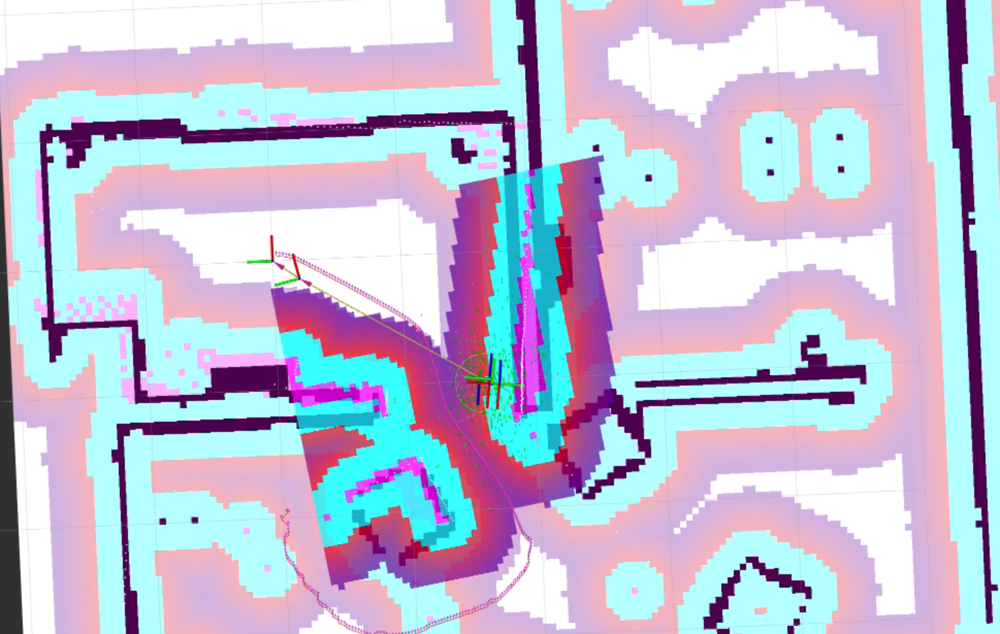

- Before Clyde is able to work on his own in a library or office, he uses a method called Simultaneous Localisation and Mapping (SLAM) to generate a detailed Occupancy Grid Map of its environment using LIDAR, which can then be used later for pathfinding. A qualified technician performs this mapping on set-up by driving Clyde around the environment manually.  The animation … shows an example of the mapping in action.

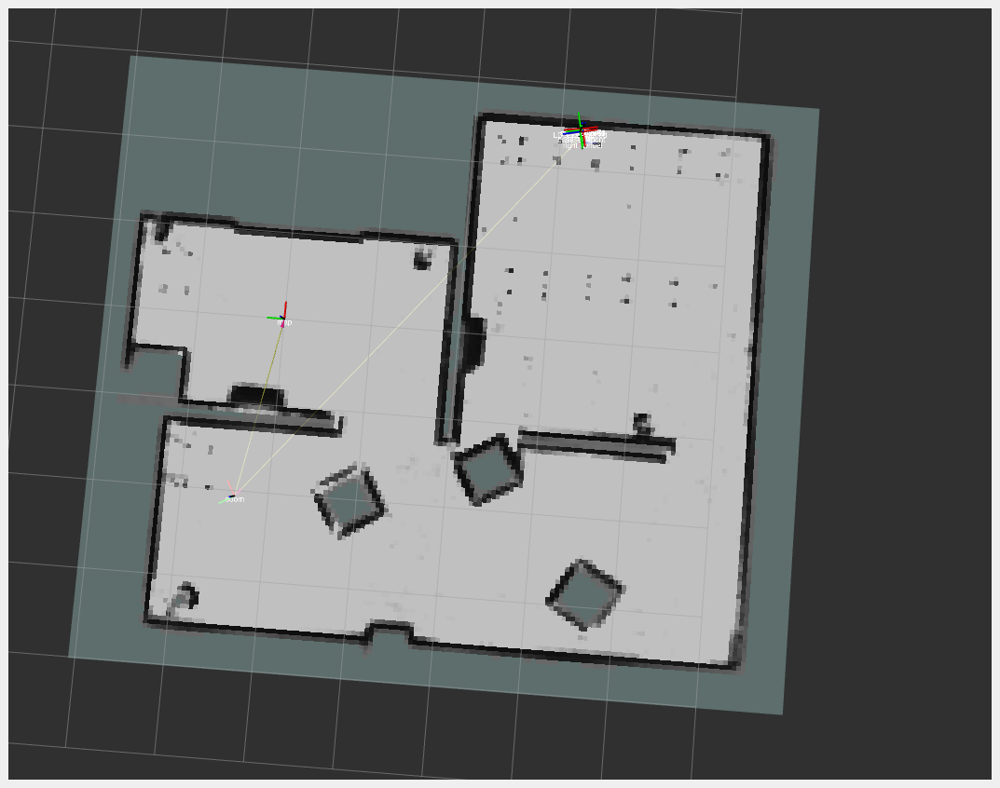

- Clyde uses the Navigation2 ‘navigation stack’ - driven by the A* search algorithm - to move between desks, while LIDAR helps Clyde detect and avoid obstacles, both stationary and moving.

- All of the above is handled by a package of automatic python scripts, meaning Clyde can turn on and go all by himself. These scripts tell Clyde where to go by querying - using WiFi - Clyde’s accompanying database that holds the positions of all tables, this information is then published using a ROS2 action client.

Most important Navigation decision: 

Navigation must rely on a precomputed floor plan. This would either be created manually, or by using SLAM (Simultaneous localization and mapping). SLAM is creating or updating a map of an unknown environment while simultaneously keeping track of the robot’s location within it. After speaking with the expert Christopher McGreavy, we investigated two suggested methods for navigation: 
- Method  1: using  SLAM  for  real-time  map-building and obstacle avoidance. 
- Method 2:  manually ‘pre-draw’ the map and use naive obstacle avoidance which involves 3 actions:  Turn left,turn right, or move backwards.

As a team, we decided on <b>Method 1</b> as it allowed us to implement a more general solution. The desk coordinates must be hard-coded,  due to the difficulty of identifying tables on the map from LIDAR  data, which is not a problem as we already need to drive the robot around for mapping the room and can store coordinates in front of tables. With this, we can create a map of any environment. However in the case of failure we were prepared to switch to method 2 for a more basic solution.

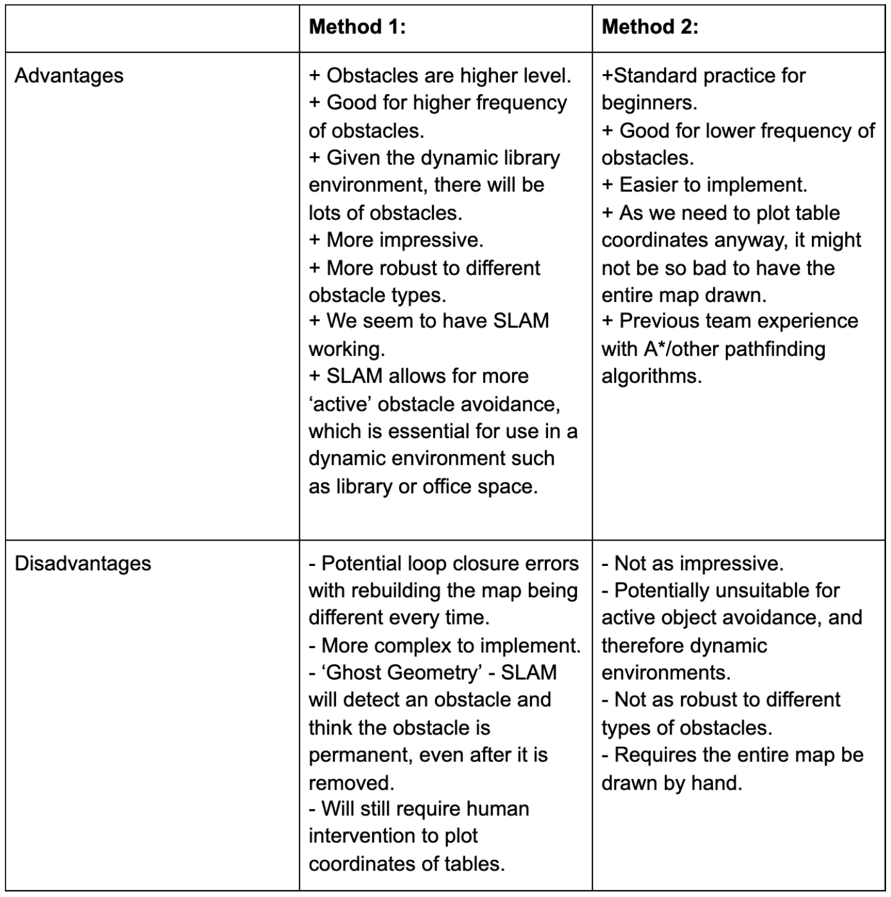

### Computer Vision

Clyde uses computer vision to perform two separate tasks. (preconditions before cleaning can be performed)

Before any cleaning is performed, ClyDe will keep adjusting the angle of the camera, take pictures of the current table and perform the following two steps.

1. Scanning QR code on desk.
Firstly, ClyDe performs a zoom in function on the picture which separates the picture into small pieces, then it tries to detect any QR codes using pyzbar on each piece of them. Pyzbar is a python package for dealing with QR code, using the decode() function in this package, ClyDe retrieves the information from the QR code. Once ClyDe gets the information from the table , it checks if the current table number matches the desired one.

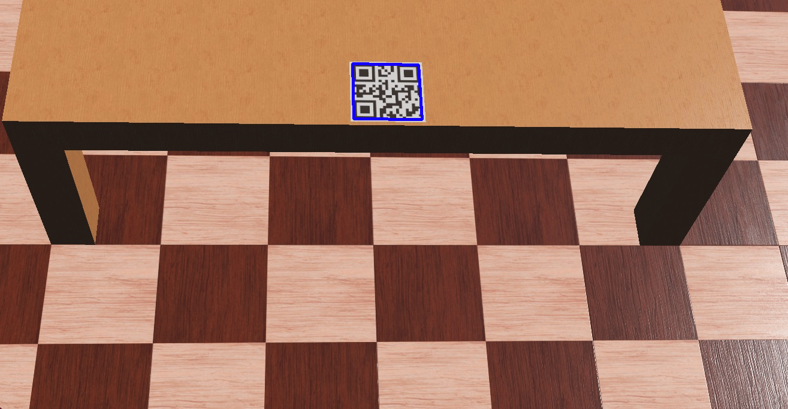

1. Detecting obstruction on desk.
After the first step is checked, the robot will use a picture of the whole table and perform an obstruction detection algorithm on it.  For obstruction detection,  ClyDe chooses OTSU algorithm thresholds any obstruction into black and thresholds the table into white and it is invariant to different lightning conditions, brightness...etc. This ensures the desk is empty before any cleaning is performed.

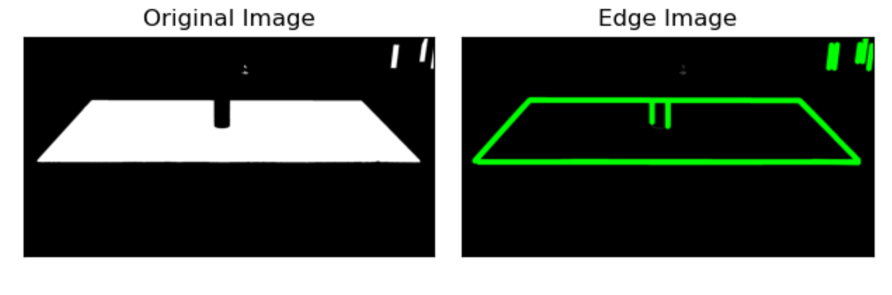

Once the cleaning is done, the robot will connect to the database and update the table’s status to “free”.

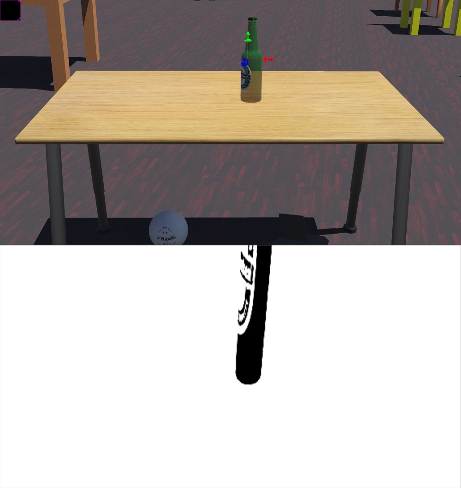

### The Arm

Once positioned at the desired desk, the arm performs the cleaning motion itself. The current version of the robot uses the PincherX 100 (?) robotic arm, which offers 5 degrees of freedom. The arm detects the surface of the desk, then carries out a series of movements to perform the sanitisation.

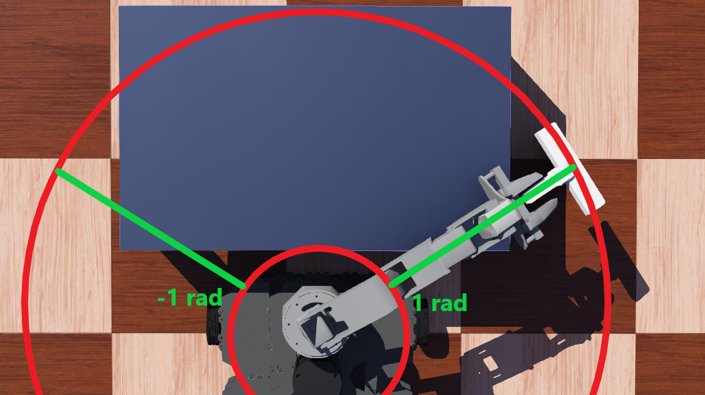

### The Cleaner

The arm is capable of cleaning the desk by swiping the squeegee across the surface of the desk. In order to clean the table, disinfectant would be distributed to the sponge throughout the whole cleaning motion through low volumes by the pump.

The webots_ros2 package contains the TrajectoryFollower class that implements the 'follow_joint_trajectory' ROS2 action. Using this and examples in the package we were able to construct a simple controller for the arm. The controller takes a list of joint states, velocities, accelerations and time to complete the action.

The [ikpy](https://libraries.io/pypi/ikpy) python package was used to calculate inverse kinematics for the arm. We used it because it provides very useful utilities for kinematics of a robot arm which would have been time consuming and error-prone to implement ourselves. Two features were used from this package. The first is the ability to create a model of an arm from a given Unified Robot Description Format(URDF) file. In order to use this feature, we modified the URDF of the arm such that it included the squeegee on the end and passed that file to ikpy. The second feature is a function which uses the model to calculate the joint states of the arm needed to reach a given 3D point along with an orientation. These are then passed to the controller, along with some predefined velocities, accelerations and times.

The software was created in a way such that the height of the cleaning motion as well as the limits of the waist movement is generalised. This means the arm cleaning motions can be adapted to any size table, given that the dimensions are suitable for the arm's reach.

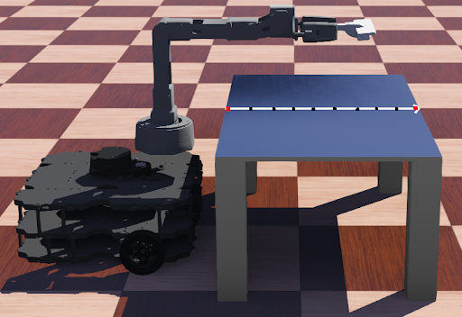

A single swipe across the desk. End points and intermediary points are shown. This image represents a swipe with **noOfPoints** parameter set to 10.

The cleaning motion consists of ‘swipes’. A swipe is defined as the act of the arm rubbing against the  table along the whole length in one direction. The swipe has a set start and end point, seen in Figure 1 below as the red dots. Several points are then generated in between the red dots, so the arm goes across the table while keeping it’s end effector against the surface the whole time. The number of these intermediary points (shown as the black dots in Figure 1) is generalised and can be changed as a parameter. In Figure 1 there are 10 points in total (meaning 8 intermediary points), which is how the robot is currently set up.

The joint angles are only computed for one swipe in practice. This essentially means the inverse kinematics only really have to work on a 2D plane, since the y value is constant. The joint angles that are calculated for this swipe are then re-used with different waist values in order to swipe across the whole surface. This minimises the number of inverse kinematics calculations that have to be performed.

Parameters of the arm software are as follows:
- **timeToDoOneSwipe** - this is the amount of time the arm takes to swipe across one length of the table (as seen above, from red dot to red dot). The value we settled on is around 10 seconds for now. Bringing the time too low reduces the stability as the in-built ros2 controller for the arm struggles to control the inertia when carrying out the trajectory.
- **noOfPoints** - this is the total number of points a swipe will have (including the red dots). As previously mentioned, we set this to 10 to get an accurate trajectory across the surface.
- **Height** - this is the height at which the arm will perform the cleaning motion at. The height of the table can be plugged into this parameter and the arm will work with it.
- **waistRange** - this is the range of values that the waist will take when carrying out the swipes. By default we have set the range as -1 to 1 radians, with 6 swipes equally spaced in that range. This range cleans the desk we have all the way, and 6 swipes ensures the squeegee makes contact with everywhere on the desk. See the Figure 2 for a visualisation of how the limits work.

### Methods:

> “Explain the key methods of how you got your system to work”

### System Diagrams:

> “You should include images (where available) which illustrate the methods you used, how the system works etc. This can include system diagrams, images of your system in certain states etc.”
