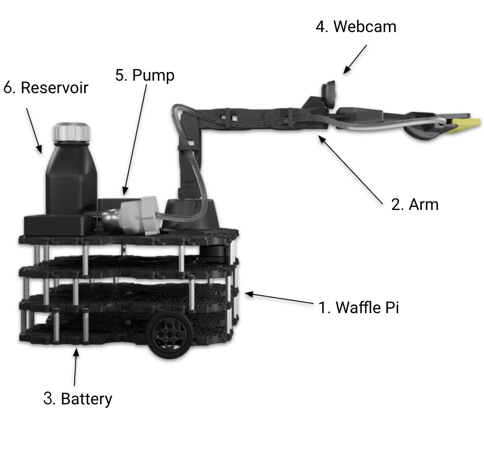
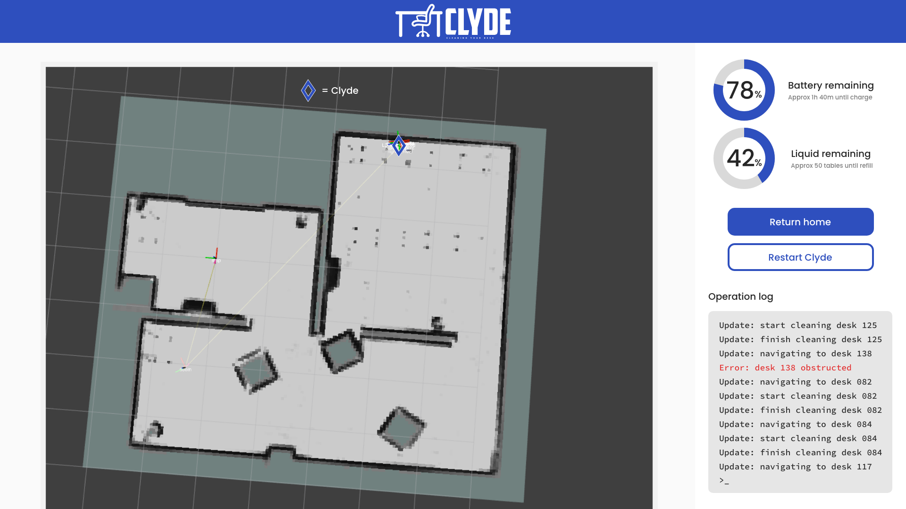

The current coronavirus pandemic has shown us just how important spaces such as libraries and offices are, but also how important and difficult it is to keep them clean and safe. ClyDe is an autonomous surface-cleaning robot meant to be deployed in these highly-trafficked spaces. It disinfects desks after they have been used, making them safe. This will assist cleaner's jobs by helping with a monotonous and repetitive task, allowing them to spend their time elsewhere.
## Clyde Components

1. Waffle Pi Turtlebot:    
This is the base and core of the robot, providing essential functionality like locomotion, and sensors. It is also home to a Raspberry Pi, ClyDe’s “brain”.  
2. Pincher x100 Robot arm with cleaning tool:   
The Pincher x100 is a versatile arm. Through it the robot performs it’s essential cleaning function.  At the tip of the arm is our specially-designed cleaning tool, that takes in disinfectant that is pumped up via tubes on the arm.
3. Battery:   
The Zeee 11.1V 8000maH Lipo Battery is high-capacity, and allows the robot to operate for several hours before needing to charge.
4. Webcam:   
The C270 Logitech USB Webcam is powerful, yet lightweight enough to be carried on the robot arm. It provides high-resolution pictures that are suitable for QR-code recognition.
5. Pump:   
The 6-12V R385 DC Diaphragm Pump is a lightweight, small, low-volume pump with a lifetime of up to 2500 hours. It is used to pump the robot’s disinfectant to the cleaning tool at the tip of the arm.
6. Reservoir:   
This contains the disinfectant liquid. Attached on the inside is a non-contact liquid sensor to monitor disinfectant levels.

## What can ClyDe do?

---

### **Surface Disinfecting**

ClyDe's main function is to autonomously clean and disinfect desk surfaces. The main target environment for ClyDe to work in are libraries, however, he could also be set to work in office spaces if desired with no modification.

ClyDe navigates throughout the environment and disinfects the surface of any desks that are marked as dirty on the accompanying database. In order to mark desks as dirty, people are asked to scan the QR code on the table using the ClyDe Companion App as they leave.

ClyDe will move to a target desk and scan the QR code on that desk in order to confirm it is the correct one. ClyDe then uses his arm which has a squeegee utensil with a sponge on the end to clean the desk. Disinfectant is absorbed into the sponge using a pump and is then spread over the table using ClyDe's cleaning arm.

ClyDe is easy to work with and maintain, all that is required after deployment is to keep the battery charged and keep the reservoir of disinfectant full.

### **Autonomous Navigation**
Using its array of sensors, CLyDe is able to map and navigate complex spaces, avoiding unforseen obstacles along the way. When ClyDe arrives, we will send a technician to set up the system for you. The technician will first manually drive the robot around the deisgnated area, and use an intuitive UI to mark down the positions of desks. This only needs to de done once as long as the rooms in question do not change. After this, ClyDe is able to move from desk to desk, cleaning as he goes!

## How does this system come into contact with users?

---

### **ClyDe Companion App**

The main way users interact with ClyDe is through our ClyDe Companion app.

#### Features
Using the app is quick and easy, start by downloading the ClyDe Companion app from the Play store!

First, users scan the QR code on the table when they arrive and start using it. Since the QR code will contain the ID of the table, this allows the user to verify they are at the right table if they have booked it. This serves to let ClyDe and other users know that the table is currently being used.

The second feature is to again scan the QR code, but this time once they have finished using the table and are leaving. This serves to let ClyDe know that the table needs to be cleaned.

It is possible in the future to integrate the app with the booking system that a library might already have in place - for instance SeatEd which is used at Edinburgh University's Main Library - allowing for a more smooth user experience.

### **ClyDe Controller**
This serves as a controller for staff to interact will ClyDe in various ways, such as telling him to start patrolling as well as to come back home.

#### Features

The controller displays information about ClyDe's status. This includes:
- Battery Level
- Reservoir Level
- Current Location
- Operation Log

See the image below for a demonstration of the UI:

The controller can also be used to give instructions to ClyDe. These instructions are kept simple in order to keep ease of use high. The instructions include:
- Start cleaning - this sets ClyDe off to begin patrolling and cleaning any desks that are marked as dirty.
- Return home - this prompts ClyDe to return to his home position, whether it be to allow you to charge the battery, refill the reservoir or simply to turn him off.
- Restart ClyDe - this restarts the system. In the case that there are technical issues, all you have to do is bring ClyDe to his home position and hit this button to reboot it all.

Mapping tutorial we made:

