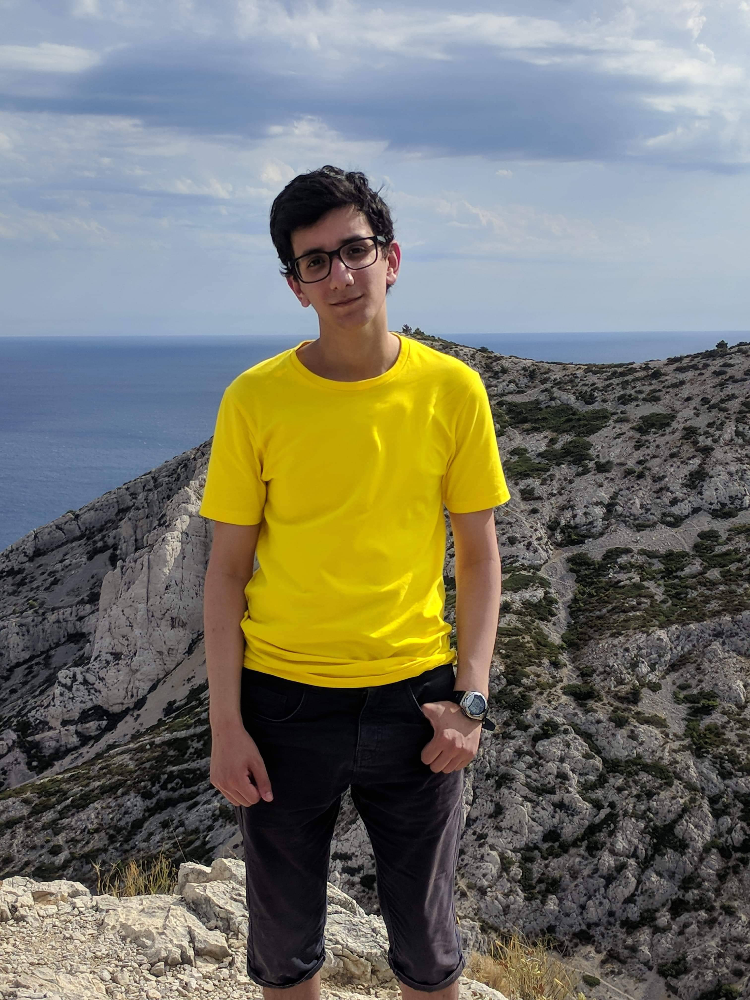
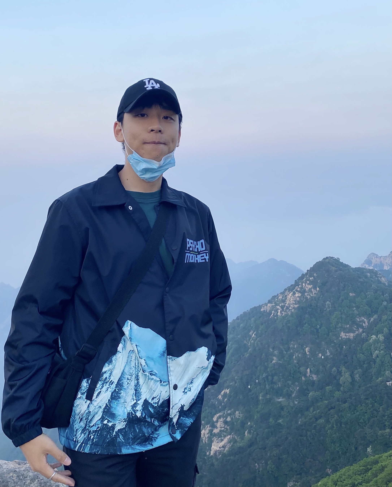
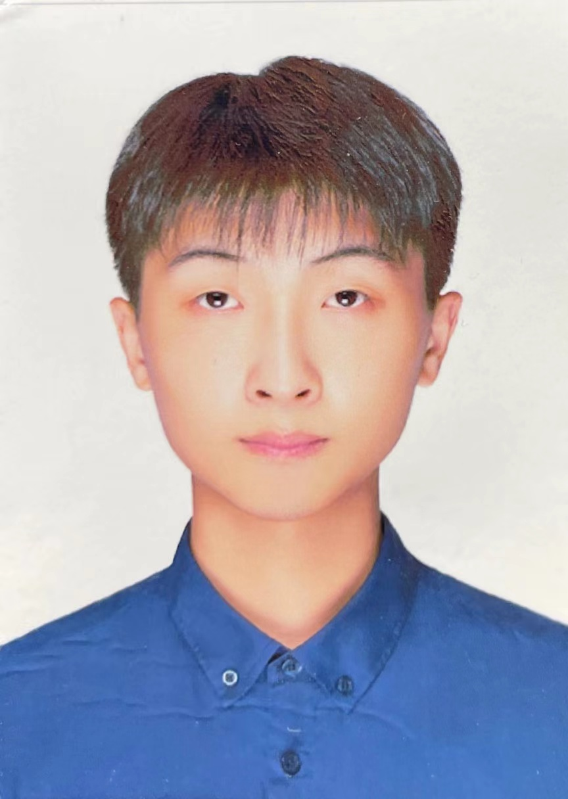
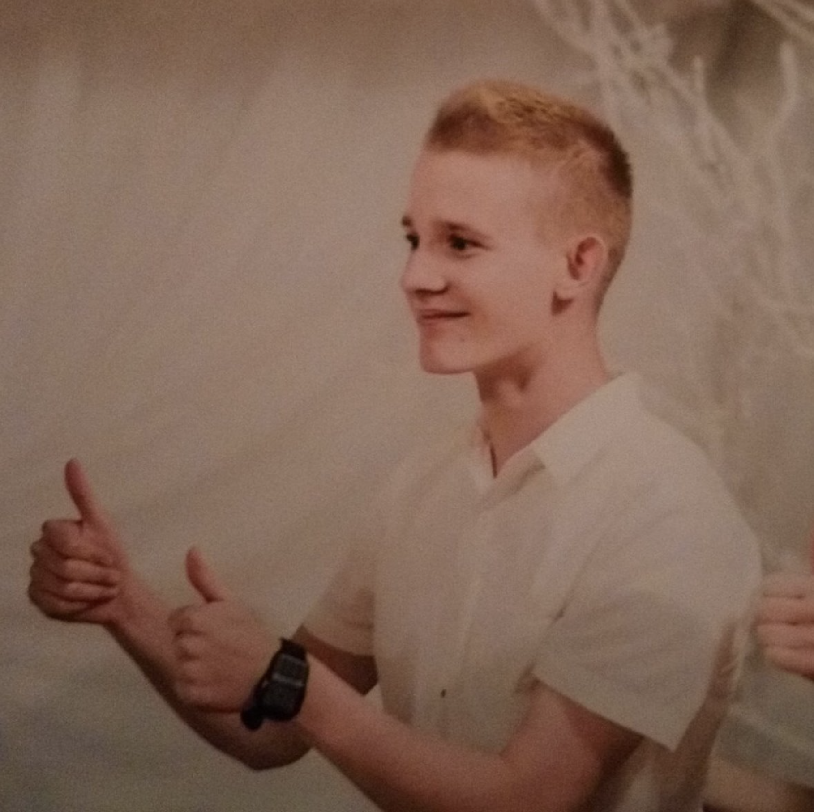

## Meet the team!

	
	

		
Lars Thalian Morstad

		
Hardware Team Leader

	

	
	

		
Adel Sefiane

		
Hardware, Arm Guy

	

	
	

		
Ryan Schuller

		
Team Leader, Hardware, Video Guy

	

	
	

		
Ivan Sun

		
Software, Evaluation Guy

	

	
	

		
Jeffrey Zhang

		
Hardware, Database, App Guy

	

	
	

		
Shining

		
Computer Vision, App Guy

	

	
	

		
Janek

		
Software, Navigation Guy

	

<!-- Add yourself here -->

## Team Management

Our team was split into two sub-teams, software and hardware. The hardware team was responsible for the physical design of the robot and testing the chosen parts remotely with help of the technicians.

Major tasks for them included desiging the cleaning tool and how it would be connected to and operated. Each sub-team had a leader that coordinated tasks and made sure progress was on track and blockers were effectively dealth with. The software team was responsible for writing control and interface software for the robot, as well as for the app. Their tasks were diverse, so the team was split into two parts. The first sub-team focused on computer vision and image processing, to be used in recognizing QR codes and obstructions on desks.

The second sub-team focused on navigation, which includes pathfinding, map-building and obstacle avoidance.

The third sub-team focused on ClyDe app UI design and function build, which achieves booking and connecting to cloud database.
While this organization proved useful for the first few weeks of the project, the hardware team soon ran out of tasks because of the simulated nature of the project. Luckily, we had as a team made sure that everyone were up to speed with what everyone else is doing through effective communication and weekly team meetings. This allowed the hardware team to assist software on numerous tasks, and made sure there was always someone ready to help out with any problems.

## Development tools

Our main task organisatation and assignment was done through Trello. This made it easy to delegate tasks to sub-teams, and to check on their progress. In our weekly team meetings, we reviewed the Trello tasks, their progress and assigned new ones.

The team used Git version control to great effect. Repositories were created for each component, and we used branches within those to work on invidividual features. This allowed us to be flexible, and made code sharing easy.

Google Drive has been an essential tool for other collaborative tasks, like the demo reports, videos and the user guide. Drive allows for easy sharing of large files, and easy integration with Google Docs, Slides and Sheets. Especially Google Docs has very useful, as it has allowed us to quickly make drafts for the reports before porting them to latex.

The team's main communication platform was Discord. It allowed us to create text channels dedicated to sub-teams, individual important tasks and team administration. This meant our communication was structured and had a low barrier to entry. Discord also supports voice communication and easy screen sharing.
