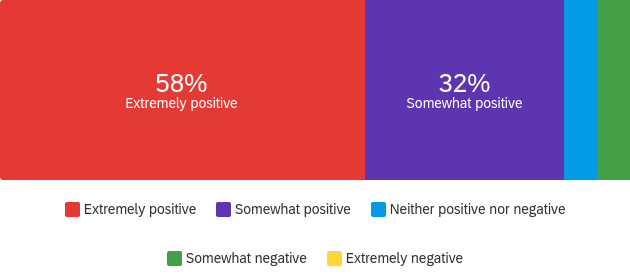
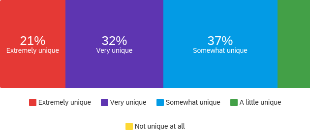

### Why choose us

You may have seen a large amount of assistive cleaning robots before -- but do they meet the certain needs given a certain environment where you really need one? Are you tried of seeing most cleaning robots limited to the household floor cleaning type, including vacuuming, sweeping and mopping. ClyDe plays a perfect role in serving table cleaning robot which will create safer public spaces due to the less exposure for cleaners and visitors. With a robot doing the monotonous and repetitive task of cleaning hundreds of desks, cleaners will be freed up to do more demanding tasks!

### Usability Analysis

We carried out a complete series of analysis before bringing the product to market. This includes usability analysis. We conducted an experiment to gather the feedback from our potential customers. The experiment involves a questionnaire. There are seven multiple-choice questions and two short answer questions. The questions include various aspects from layout to logic. Below are the results of the experiment.

The general impression of the product is quite positive. 90% of the candidates give general positive feedback to the product. 95% of the candidates think this product is believable and reliable, meaning that there will be few difficulties when they use this product. 95% of the candidates also like the idea and find it relevant to their life. 
The product may lack some innovation; only 53% of the candidates think this product is extremely or very unique. Since the product remains as a prototype currently, only 53% of the candidates find the layout very appealing with an additional 32\% who think it is somewhat appealing. 

Overall, it can be concluded that the business idea of the cleaning robot and accompanying product proves to be very successful!

### See what our customers say about our products!

>The robot detecting the right time to sanitise the desks is a very neat idea.

>In the current global situation, reducing the risk to a human, however small if equipped with the proper protective gear, when cleaning surfaces is a great idea.

>Straight forward app and system. Easy to use.

>The system seems very intuitive and the concept is easy to visualize.

>I like the idea of having an automatic sanitising system for high traffic areas, as this is a solution to an extremely important problem in current times.
